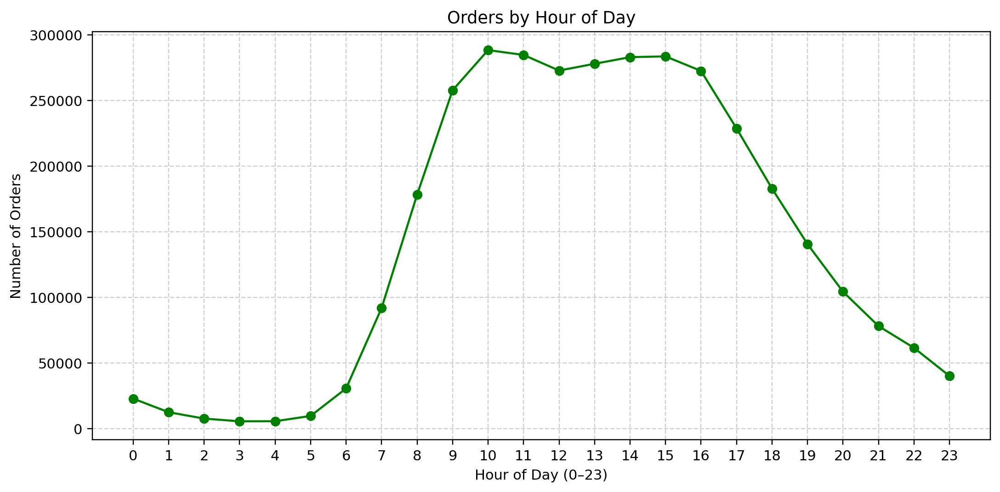
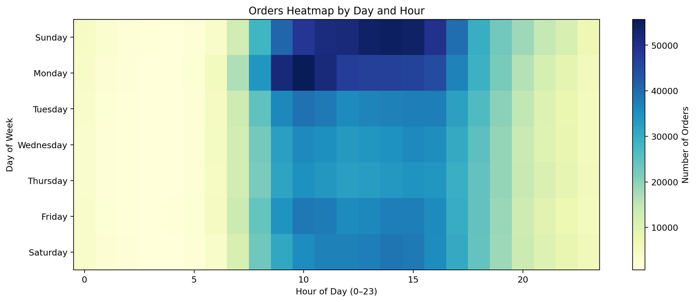
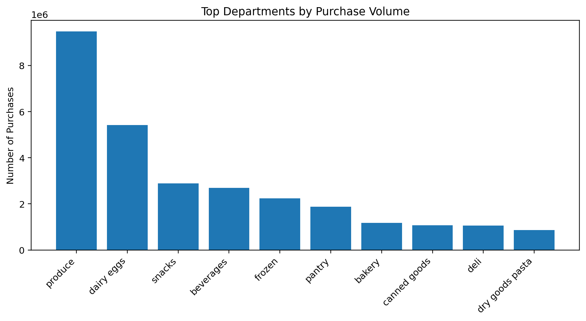
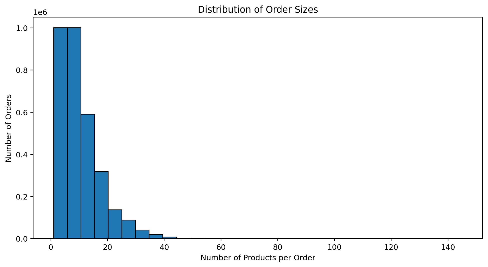

# 🛒 Instacart Sales & Customer Behavior Analysis


Analyze over **3 million grocery orders** to uncover customer demand patterns, product loyalty, and business insights using **SQL + Python**.  
This project demonstrates how to combine **SQL, Python, and data visualization** for real-world business analytics.

---

## 📂 Dataset 

This project uses the [Instacart Online Grocery Shopping Dataset 2017](https://www.kaggle.com/c/instacart-market-basket-analysis) from Kaggle.

- 🛒 **orders.csv** → order metadata (order ID, user ID, order time, day of week)  
- 📦 **order_products_prior.csv / order_products_train.csv** → products included in each order  
- 🥑 **products.csv** → product information (ID, name, aisle, department)  
- 🗂 **aisles.csv / departments.csv** → category hierarchy  

This dataset is widely used for **basket analysis, recommendation systems, and customer behavior studies**.

---

## 🔄 Methodology

1. **Data Loading**: Load CSV files into SQLite database.  
2. **SQL Queries**: Perform ad-hoc analysis (counts, groupings, joins).  
3. **Python Integration**: Use pandas to query, clean, and transform results.  
4. **Visualization**: Build charts with matplotlib (barplots, histograms, heatmaps).  
5. **Business Insights**: Translate findings into actionable recommendations.

---


## 🗂 Project Structure
```text
port-sql-project/
│
├── data/                # Raw and processed data (not uploaded to GitHub)
├── notebooks/           # Jupyter notebooks with analysis
│   └── 01_instacart_eda.ipynb
├── scripts/             # Data loading and setup scripts
├── src/                 # Database connection utilities
├── reports/             # Final figures and storytelling
├── environment.yml      # Reproducible conda environment
└── README.md            # Project documentation
```

---

## ⚙️ Tools & Technologies
- **Python**: pandas, matplotlib  
- **SQL**: SQLite (queries integrated via pandas)  
- **Jupyter Notebook**: interactive analysis and storytelling  
- **Conda**: environment management  

---

## 📊 Key Analyses & Insights

### 1. Demand Patterns
- **Orders peak between 10 a.m. and 3 p.m.**, especially on Sundays and Mondays.  
- 📈 *Heatmap*: Orders by day of week × hour of day.  

### 2. Products & Departments
- **Produce** (fruits & vegetables) dominates sales, followed by Dairy & Eggs, Snacks, and Beverages.  
- 🥑 *Barplot*: Top departments by purchase volume.  

### 3. Basket Size & Customer Behavior
- **Average basket size ~10 products/order**, but most fall between 5–15 items.  
- Customers segmented into buckets (1 order, 2–5 orders, 6–10 orders, etc.), showing both one-time and loyal shoppers.  
- 📊 *Histogram*: Distribution of basket sizes.  

### 4. Reorder Dynamics
- **~58% of products are reorders**, reflecting strong customer loyalty to familiar products.  
- 🥛 *Barh chart*: Top products by reorder rate (with support ≥ 50k).  

---

## 🖼️ Visual Highlights
**Orders by Hour of Day**  


**Orders Heatmap (Day × Hour)**  


**Top Departments by Purchase Volume**  


**Basket Size Distribution**  
  

---

## ✅ Business Takeaways
- **Operational efficiency**: Staff and logistics should be prioritized during peak hours (10 a.m.–3 p.m.).  
- **Stock management**: Fresh produce and dairy must remain in stock as they drive the majority of purchases.  
- **Customer retention**: High reorder rates suggest opportunities for loyalty programs and product bundling.  
- **Marketing**: Promotions can target low-demand mid-week periods and leverage “anchor products” to drive cross-sell.  

---

## 🚀 How to Run

1. Clone the repository:
```bash
git clone https://github.com/CodingwDanny/instacart-analysis.git
cd instacart-analysis
```

2. Create and activate the conda environment:
```bash 
conda env create -f environment.yml
conda activate port-sql
```

3. Launch Jupyter Notebook:
```bash
jupyter notebook
```

4.	Open the notebook:

	•	Navigate to notebooks/01_instacart_eda.ipynb
	•	Run the cells step by step to reproduce the analysis

##  Author
Developed by **Danny Chacon Madrigal**
- [LinkedIn](https://www.linkedin.com/in/danny-chac%C3%B3n/)  
- [GitHub](https://github.com/CodingwDanny)

---
License: MIT – Feel free to use and adapt this project with attribution.